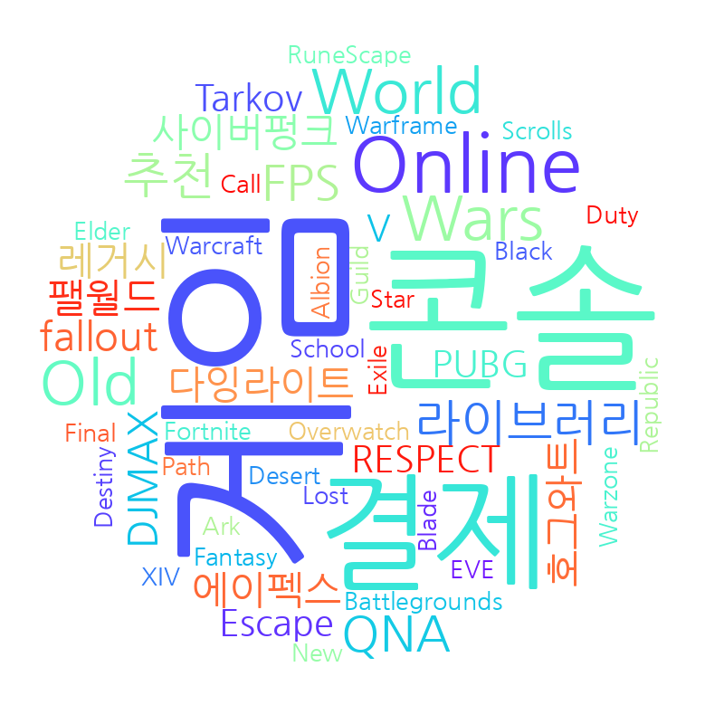
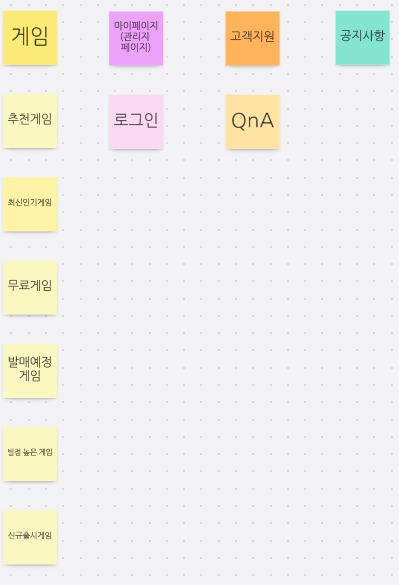
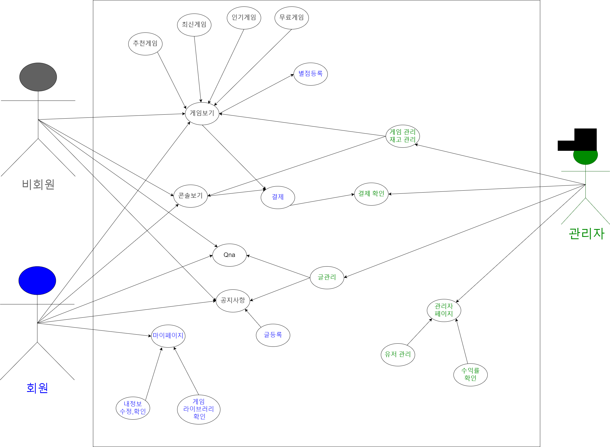
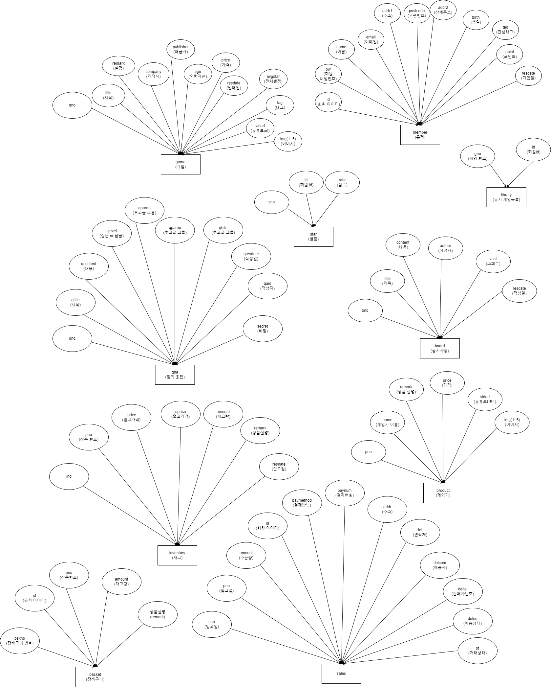
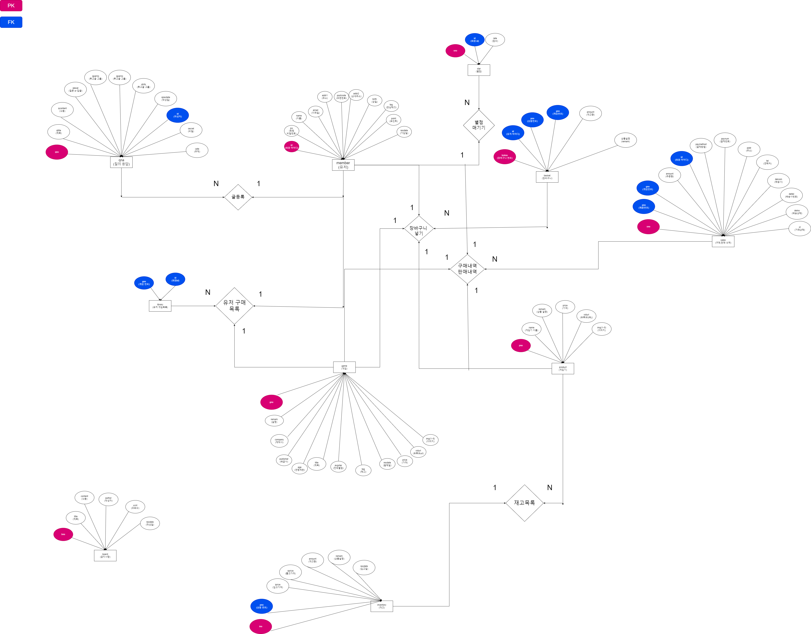
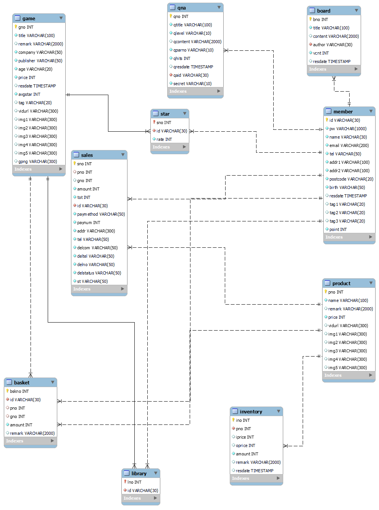

#프로젝트 개발 보고서(Project Development Report)
----------------------------------------------
## 1. 프로젝트 개요(Project Outline) 

```
다양한 게임들을 모아놓은 게임 플랫폼 웹서비스를 만든다.
```

## 2. 프로젝트 목적(Project Purpose)
```
유저에게 다양한 카테고리를 통해 게임정보를 보여주고
구매 및 평가 서비스를 제공한다.
```

## 3. 프로젝트 개발 환경 정보(Project Development Envirment)   


    - Topic : sqlgames web application
    - Develop Envirment : Open JDK 11
    - Languege : Java 11
    - Web Module : Jsp/Servlet 3.0
    - Process Pattern : MVC Pattern
    - Database System : Mysql 8.0.31
    - Database Design : Mysql Workbanch
    - Entity Relationship Design : draw.io 20.8.16
    - Java Database Connector : mysql-connector-java-8.0
    - Application Design : Object aid 1.2.4
    - Back Template Languege : Java/Servlet 11
    - Front Template Languege : Jsp(JSTL/EL) 3.0/HTML5/CSS3/Javascript ES5
    - Web (Application) Server : Tomcat 9.0
    - Navigation Design : WordCloud 3.7, Card Sort BoardMix

### 3-1. 기술 스택(Tech Stack)


<br><br><br>

## 4. 프로젝트 기획 및 설계(roject Planning & Design)

### 4-1. 네비게이션 설계(Navigation Design)

| 게임 | 마이페이지(관리자 페이지) | 고객지원 | 공지사항 |
|--------|---------|-------|--------|
| 추천게임 | 로그인 | QnA | &nbsp; |
| 최신인기 게임 | &nbsp; | &nbsp; | &nbsp; |
| 무료 게임 | &nbsp; | &nbsp; | &nbsp; |
| 발매예정 게임 | &nbsp; | &nbsp; | &nbsp; |
| 별점 높은 게임 |&nbsp; | &nbsp; | &nbsp; | &nbsp; |
| 신규 출시 게임 |&nbsp; | &nbsp; | &nbsp; | &nbsp; |

<br>

#### 4-1-1. 자료 수집


#### 4-1-2. 콘텐츠 분류


#### 4-1-3. 서비스 흐름 설계


### 4-2. 데이터베이스 설계(Database Design)

#### 4-2-1. 개념적 설계

### 4-2-2. 논리적 설계

### 4-2-3. 물리적 설계

